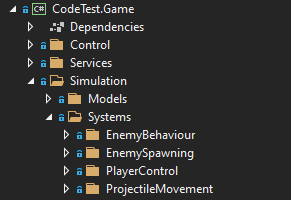

<h1>

Air-Sea Battle
</h1>

[](https://unity.com/releases/editor/whats-new/2023.2.20) [](https://youtu.be/TL1X6Fn5d1Y)


Completed _(and over-engineered)_ in ~8 hours by Fydar.

## Overview

### Architecture

_"I approached this problem by first creating my **out-of-engine library** that will power the simulation of the game world."_

> ✨ **Benefit:** I can run **automated tests** outside of the game engine.\
> ✨ **Benefit:** I can easily rebuild the game in a **different game engine**.\
> ✨ **Benefit:** I can easily create **in-browser versions** built on WASM for tools.\
> ✨ **Benefit:** I can create **game servers** that require minimal overhead from the engine.\
> ✨ **Benefit:** I have full access to the **build pipeline** for my DLLs.\
> ✨ **Benefit:** I can use the latest language features such as `nullable` without having to  worry about Unity's APIs.
> 
> 🔥 **Downside:** I don't have _direct_ access to **Unity's APIs and systems**\
> 🔥 **Downside:** I have to **git-commit DLLs** built from the library into the Unity project.\
> 🔥 **Downside:** I'm going to get a bad reputation for **over-engineering stuff**.

### Library APIs

The first thing I tackled was making sure that the APIs for interacting with the out-of-engine library for the game where going to be powerful enough to easily finish the game in Unity.


#### Creating a world

Something I wanted to do was to seperate the **data of the entity** and the **systems** that drove the gameplay. This is one of the core principles of an **ECS**. I will not fully implement an ECS due to time constraints, but I have implemented one before in [RPGCore.World](https://github.com/Fydar/RPGCore/tree/main/src/libs/RPGCore.World) that I considered reusing for the code tet.

To create this Entity-System (ECS-minus-the-components) I wanted to use a factory pattern. Entity-Systems will have systems that run in the scope of a `World`. I created the below API for creating game worlds and registering game systems.


The idea is that the game can be extended by appending game systems to the `WorldEngine`; and that this will allow for more modular and flexible code.

You then create a world using the `WorldEngine` and supply additional configuration data so that each world can operate on seperate configuration data.

More complex configuration can be passed in at this stage; including `IConfigurationService`s that source their data from a remote server.


Finally, a class representing the `LocalPlayer` is added to the world. We maintain a reference to the `playerInput` so that we can inform the game simulation of our local players input actions.

#### The "Update" loop

Now that we have an instantiated world, we can operate a gameplay loop. The gameplay loop will look something like what we have below, with the inputs being updated in the `playerInput` object and read by the simulation in `world.Update()`.

For the simulation to be able to adapt to the user framerate, `Time.deltaTime` is supplied to the simulation. This could alternatively handled by invoking the simulation update at a fixed tickrate instead.


#### Rendering the world

Without a UI library or a game engine, rendering the world is quite difficult. To test this in the console, we are simply going to write messages to the console. The same principles below are also used in Unity to drive more complex rendering behaviours.

I decided to output events from the game world using [RPGCore.Events](https://github.com/Fydar/RPGCore/tree/main/src/libs/RPGCore.Events) as opposed to the `System.ComponentModel` approach of `INotifyPropertyChanged` and `ObservableCollection` as I have created a set of handy shorthands for creating events.

To use RPGCore.Events, I must create an event handler. Below is a very simple implementation that will write details about the event to the `Console`.

> _"RPGCore.Events currently doesn't have support for an `IList<T>` implementation of a collection, so every entity in this project is indexed by a `Guid`."_


Now that we have an event handler, we can use it to subscribe to events that fire from our `World`.

To do this I'm going to be using a nifty shorthand `.AddAndInvoke` which will add our handler to the `EventDictionary<TKey, TValue>` and invoke the `OnAdd` method for each item that already exists in it.


Now we can put it all together and our console output will look something like this.

```txt
Starting rendering entity 'bde0fef5-e8ef-44bb-9bce-0ffbae6c0bc0'.
Starting rendering entity '18e07221-9e1e-4999-aefc-815fd79f5241'.
Starting rendering entity '1af4f509-8dc0-41ed-a913-00534b928ed7'.
Starting rendering entity 'be7e69dc-b380-4292-8f4b-4f9478ad4fb9'.
```

> _"Now that we are familiar with the APIs for interacting with the game library; we can take this into Unity and create a better looking version of the game (that players can actually interact with!)"_

### The "Systems"

There are four systems that drives the simulation, shown below. Since all of these systems are made **outside** of Unity, I will not have access to Unity APIs for collision detection and physics.



Every system implements `IWorldSystem`. This interface provides abstractions that allow systems to drive the behaviour of the game at set events in the world, such as when a player joins the game, leaves the game, or a "simulation tick" is performed.

#### The "EnemyBehaviour" system

The enemy behaviour system is responcible for moving enemy ships across the screen and resetting them when they leave the reset.

This system does nothing when a player joins and leaves the game world, so these methods are left blank.

In the `OnUpdate` method, we loop through all the enemies and translate their positions by their velocity. If the resulting positon is considered "out-of-bounds" then we move them back to the left side of the screen.


#### The "EnemySpawning" system

The enemy spawning system is responcible for creating enemy ships when none are present after a short delay.

This system does nothing when a player joins and leaves the game world, so these methods are left blank.

In the `OnUpdate` method, we check to see if the game has ended and early-out if it has as we don't want to do anything if the game is over. We also early-out if there are already enemies in the world, in-which-case this system lies dorment.

Finally, when no enemies are around, we can advanced our clock and after a configured time has past we can spawn a new wave of enemies.

There is some messy logic used to calculate the rows and heights of enemies that need to be spawned.


#### The "PlayerControl" system

The player control system is responcible for giving the player a gun and allowing their input to modify the state of the gun in the world. This system is also responcible for creating projectiles when the gun is commanded to shoot.

When the player joins the world, a new `WorldGun` is created (belonging to them) and added to the game world.

When the player leaves the world, all `WorldGun`s belonging to that player are removed.

In the `OnUpdate` method, we check to see if the game has ended and early-out if it has as we don't want to do anything if the game is over. We then determine what `targetAngle` all of the players `WorldGun`s should be in based on that players `SimulationInput`.

Once we have determined a `targetAngle` for all guns belonging to the player, we iterate through all of the players `ControlledGuns` and change their angle to match our new `targetAngle`.

If the player uses their `Fire` button, we first check to see whether the maximum number projectiles has already been exceeded. If we are able to create a projectile at the position relative to the players gun as defined in configuration.

The created project is given a velocity that is rotated by an angle as defined in the configuration.


### The "ProjectileMovement" system

The player control system is responcible for advancing projectiles by their assigned velocities and then detecting whether the projectiles have collided with any enemies. Projectiles also have to be cleaned up if they have left the play space defined in `World`.

This system does nothing when a player joins and leaves the game world, so these methods are left blank.

In the `OnUpdate` method, we check to see if the game has ended and early-out if it has as we don't want to do anything if the game is over.

We then iterate through all of the projectiles in the world and advance the projectiles positions by their velocity (subject to `DeltaTime`).

We then check to see if this project is still contained within the world bounds; if the projectile is out-of-bounds then it is removed.

We then perform an axis-aligned box collision detection on each of the enemy ships in the world. If the projectile overlaps with any of them then the enemy is destroyed and the owner of the projectile is awarded points.

There is logic in this system that would be desirable elsewhere in the project for reuse; such as the method to destory and remove enemies and the method to award the player score. For the sake of simplicity I opted to keep the code where it is.


## Sources

Gameplay footage of the original _'Air-Sea Battle - (1977) - Atari 2600'_ Available at: <[https://www.youtube.com/watch?v=YpZ7GfneiO0](https://www.youtube.com/watch?v=YpZ7GfneiO0)> [Accessed 3 June 2021].

Documentation for `System.TimeSpan.ToString()` Available at: <[https://docs.microsoft.com/en-us/dotnet/api/system.timespan.tostring](https://docs.microsoft.com/en-us/dotnet/api/system.timespan.tostring?view=netstandard-2.0)> [Accessed 4 June 2021].

Documentation for `System.Collections.ObjectModel.ObservableCollection` Available at: <[https://docs.microsoft.com/en-us/dotnet/api/system.collections.objectmodel.observablecollection-1](https://docs.microsoft.com/en-us/dotnet/api/system.collections.objectmodel.observablecollection-1?view=netstandard-2.0)> [Accessed 4 June 2021].

### Industry.Simulation

I used a deterministic maths library I created a couple of weeks ago to power the game simulation.

- Fixed-point number
- Fixed-point Vector2s
- Fixed-point boxes
- Fixed-point mathmatics

The libraries source code is currently not public on my GitHub; but I hope to make it public soon.

Below is a simple example of a physics simulation created with Industry.Simulation in Blazor.


I could have used `System.Numerics` (as it is .NET Standard compatible), but if I wanted to use `UnityEngine.Vector2` then I wouldn't be able to make the game outside of Unity.

### RPGCore.Events

RPGCore.Events is an event-system API I created as apart of the [RPGCore project](https://github.com/Fydar/RPGCore). It allows for an alternative to `INotifyPropertyChanged` and `ObservableCollection` for model change notifications.

### RPGCore.Documentation

RPGCore.Documentation is a toolkit for producing documentation for projects. I created it as apart of the [RPGCore project](https://github.com/Fydar/RPGCore). It is used to generate syntax-highlighted code screenshots in this README document.

### Newtonsoft.Json

I am also using `Newtonsoft.Json` to power my serialization. I would have used `System.Text.Json` if it was more compatible with Unity (hopefully it will be soon. I've got some shims that make it work but I haven't tested it enough yet). Of course, I could have used Unity's default `JsonUtility`, but `Newtonsoft.Json` has a lot more features.
